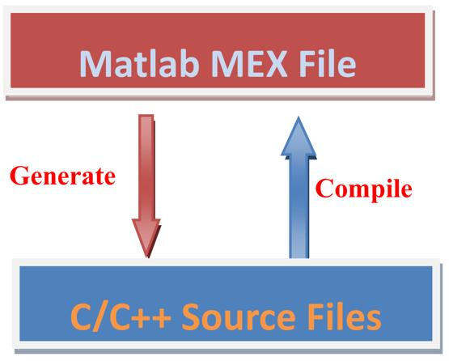

[](https://ww2.mathworks.cn/matlabcentral/fileexchange/133742-mex-file-code-generation)

# MATLAB MEX file For C/C++ code generation



## OverView

In order to call external C/C++ library functions, it is generally recommended to use the [mex](https://ww2.mathworks.cn/help/matlab/ref/mex.html) built-in function to compile the source code into a mex executable file, but the disadvantage is that it is not easy to generate C/C++ code in turn if there are other matlab code mixed in. This example is just to show how to use [codegen](https://ww2.mathworks.cn/help/coder/ref/codegen.html) two-way through this process, not limited to the example itself, is a general method, another advantage is not limited to the code generation of various restrictions, fully integrated with C/C++ programming.

## Requirements

- MATLAB
- Matlab Coder toolbox
- [Supported and Compatible Compilers](https://ww2.mathworks.cn/en/support/requirements/supported-compilers.html)
- Your External C/C++ Library(This example uses OpenCV as an example)

## How to setup

### 1.Configuring the compiler

In the command window,configure your complier.

```matlab
mex -setup C++ 
```

### 2.Source Code Preparation

Prepare your C/C++ code and MATLAB entry-point function.Prepare the implementation of the `updateBuildInfo(buildInfo, buildContext)` member function, rewritten according to the path of the external library. (header files and library files).

### 3.Generate or Compile

Generate or compile the files you want with the `codegen` command.
For example:

```matlab
imagePath = "./test_480x640x3.jpg";
input1 = coder.typeof(imagePath);
input1.StringLength=inf;
codegen -config:mex imread_opencv -args {input1}  -lang:c++ -report
```
